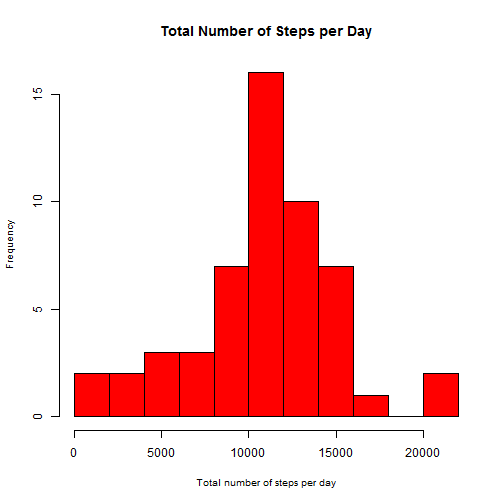
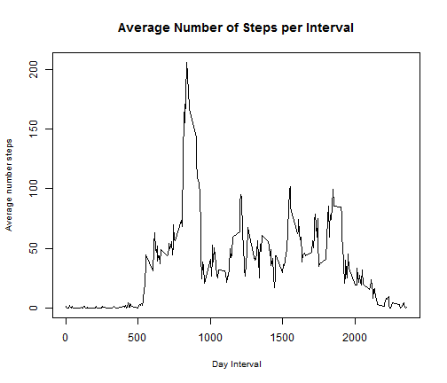
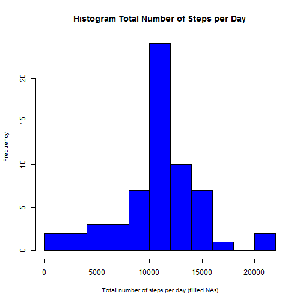
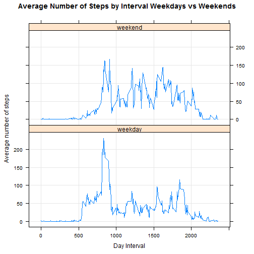

Reproducible Research Assignment 1
========================================================

The objective of this assignment is to analyze personal movement data and create a file that will allow to reproduce the research.

**1. The first step is to read the data and present a histogram of the total number of steps taken each day**


```r
activity <- read.csv("activity.csv", header = TRUE)
sum_date <- aggregate(steps ~ date, data = activity, na.action = na.omit , sum)
hist (as.numeric(as.character(sum_date$steps)) , col = "red" , main = "Total Number of Steps per Day"
      , xlab = "Total number of steps per day", ylab = "Frequency" ,  
      breaks = 12,  cex.lab = 0.8)
```

 

**2. Calculate the mean of the total number of steps per day**

```r
options(scipen=999)
act_mean <- mean(sum_date$steps)
act_median <- median(sum_date$steps)
```

The mean is 10766.1887

The median is 10765

**3. The next step is to create a plot of the sampling intervals based on the average number of steps across all days**


```r
mean_interval <- aggregate(steps ~ interval, data = activity, na.action = na.omit, mean)
```


```r
plot ( mean_interval$interval, mean_interval$steps 
      , type = "l" , main = " Average Number of Steps per Interval ", ylab = "Average number steps", xlab = " Day Interval" , col = "black" , cex.lab = 0.8)
```

 


```r
max_interval <- mean_interval$interval[which.max(mean_interval$steps)]
num_na <- sum(is.na(activity$steps))
```
The  five minute interval , across all days in the data set, that contains the max number of steps is interval 835

**4. Imputting missing values**

The total number of missing values is 2304

In order to decide on a strategy to fill the missing values, the number of missing values per day is analyzed. The objective is to find out if the missing values are spread across many days or they are missing for entire days.

Missing values were found for 2 days in October and 6 days in November. A new data set without misssing values is created by populating the missing values with the mean across all days for the 5 minute interval. The criteria is that the value used should have little impact on the data.

The code used to create the data set is shown below:

```r
activity_no_na <- merge(activity, mean_interval, by = "interval", suffixes = c("", ".y"))
nas <- is.na(activity_no_na$steps)
activity_no_na$steps[nas] <- activity_no_na$steps.y[nas]
activity_no_na <- activity_no_na[, c(1:3)]
```


```r
sum_date_nona <- aggregate(steps ~ date, data = activity_no_na, sum)
hist (as.numeric(as.character(sum_date_nona$steps)) , col = "blue" , main = "Histogram Total Number of Steps per Day"
      , xlab = "Total number of steps per day (filled NAs)", ylab = "Frequency" ,  
      breaks = 12,  cex.lab = 0.8)
```

 

The histogram is consistent with the expected results and the criteria used to fill the missing values. 


```r
mean_nona <- mean(sum_date_nona$steps)
median_nona <- median(sum_date_nona$steps)
```

The mean of the number of steps taken per day is 10766.1887. The value without missing values was 10766.1887 The  mean of the two data sets are the saeme and this is consistent with the strategy used to populate the missing values    
The median of the number of steps taken per day is 10765. The value without missing values was 10766.1887 The two values are almost the same and this is consistent with the strategy to populate the missing values.

**5.Pattern difference between weekdays and weekends**

A panel plot will be used to compare the patterns between weekdays and weekends. The first step is adding to the data set with filled missing values a field to identify if the day is a weekday or a weekend. The next step is to calculate the mean by interval for weekends and weekdays. Finally, a data set with the mean for the two data types is created.


```r
activity_no_na$weekday <- (ifelse(weekdays(as.Date(activity_no_na$date)) %in% c("Saturday","Sunday"),"weekend", "weekday"))

mean_interval_weekend<- aggregate(steps ~ interval, data = subset(activity_no_na, activity_no_na$weekday %in% c ("weekend")), FUN = mean)

mean_interval_weekday<- aggregate(steps ~ interval, data = subset(activity_no_na, activity_no_na$weekday %in% c ("weekday")), FUN = mean)

mean_interval_weekend$daytype <- "weekend"

mean_interval_weekday$daytype <- "weekday"

mean_interval_by_type <- merge (mean_interval_weekend,mean_interval_weekday, all = TRUE )
```

The panel plot with the two patterns is shown below. The library lattice is used to create this plot.


```r
library (lattice)

xyplot ( mean_interval_by_type$steps ~ mean_interval_by_type$interval | mean_interval_by_type$daytype , 
         type = "l" , main = "Average Number of Steps by Interval Weekdays vs Weekends",  ylab = "Average number of steps" , xlab = "Day Interval",
         grid = TRUE, stack = FALSE, layout = c(1,2))  
```

 
